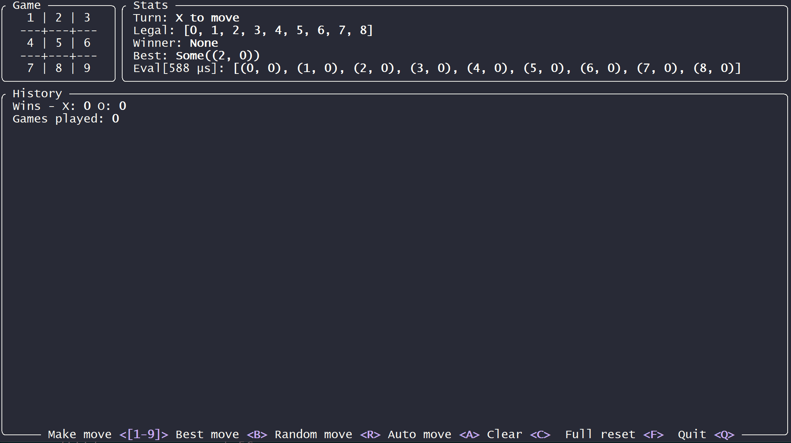

# rusttt

A (Rust,) ***based*** tic-tac-toe game. Using this project to learn [Rust](https://rust-lang.org/) and [Ratatui](https://ratatui.rs/).



## Installation

Clone the repo [https://github.com/mattgianni/rusttt](https://github.com/mattgianni/rusttt), and use `cargo run --release` to run:

```bash
git clone https://github.com/mattgianni/rusttt
cd rusttt
cargo run --release
```

Running the **debug** version with `cargo run` works too, but why?
